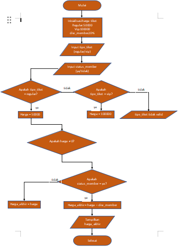
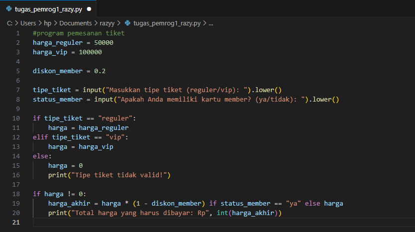
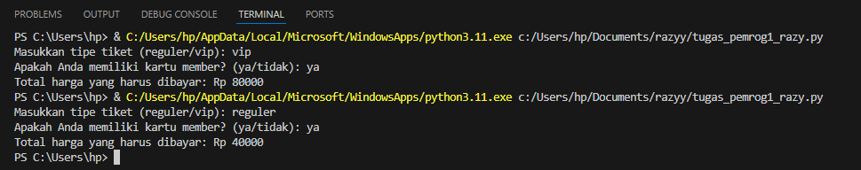

# labpy02
Nama : Razy Al Farisi 

Nim :312410524 

Kelas :TI.24.A.5 

Mata kuliah : Bahasa Pemrograman 

## program pemesanan tiket
### flowchart
ini dalam bentuk flowchart

- **Mulai:** awal proses dimulai 

- **Inisialisasi Harga Tiket:** 

Tentukan harga tiket:

Tiket Reguler: Rp50.000

Tiket VIP: Rp100.000

Diskon Member: 20%

- **Input Tipe Tiket:** Pengguna memasukkan tipe tiket yang ingin dibeli (reguler atau VIP).

- **Input Status Member:** Pengguna memasukkan status keanggotaan (ya atau tidak).

- **Validasi Tipe Tiket:** Periksa apakah tipe tiket yang dimasukkan valid (reguler atau VIP).

Jika ya, lanjut ke langkah berikutnya.

Jika tidak, kembalikan input tipe tiket.

- **Tentukan Harga Berdasarkan Tipe Tiket:** 

Jika tipe tiket adalah "reguler", maka harga tiket adalah Rp50.000.

Jika tipe tiket adalah "VIP", maka harga tiket adalah Rp100.000.

- **Periksa Apakah Harga Tidak Nol:** 

Periksa apakah harga tidak sama dengan nol.

Jika ya, lanjutkan ke langkah berikutnya.

Jika tidak, kembali ke input tipe tiket.

- **Cek Status Member dan Hitung Diskon:** 

Periksa apakah pengguna memiliki status member (ya atau tidak).

Jika ya, hitung harga akhir dengan diskon (harga * 0.8).

Jika tidak, harga akhir tetap sama dengan harga tiket.

- **Tampilkan Harga Akhir**:Tampilkan total harga tiket yang harus dibayar oleh pengguna.

- **Selesai:Proses selesai**.

### python
ini dalam bentuk program python

### hasil 
ini hasil eksekusi dari program python di atas

